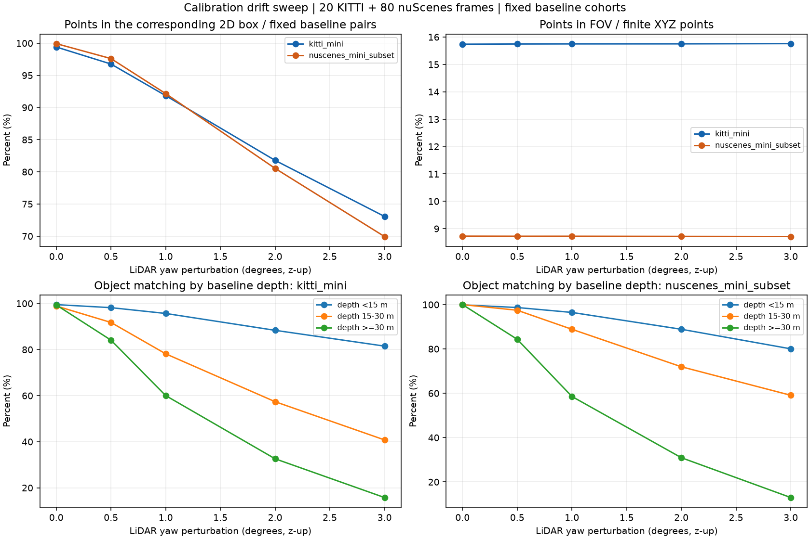
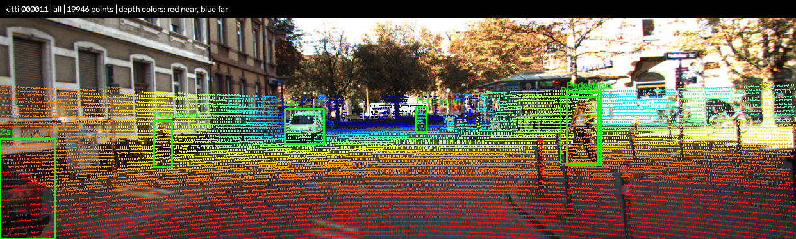
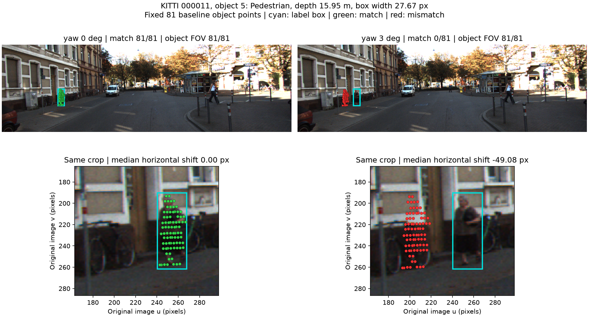

# Báo cáo Day 6: Độ nhạy của phép chiếu LiDAR-camera với lệch yaw

- **Họ tên:** Nguyễn Văn Diện
- **MSSV:** 02615
- **Lớp:** AI20K-T4
- **Link repo:** https://github.com/diendls321-commits/NguyenVanDien-02615-Track4-Day21
- **Topic:** A — LiDAR-camera projection QA, mức Good.
- **Dataset:** `data/kitti_mini`, `data/nuscenes_mini_subset`; `data/synthetic` để kiểm tra phép chiếu.
- **Các frame đã dùng:** toàn bộ 20 frame KITTI: `000001, 000004, 000007, 000008, 000009, 000010, 000011, 000012, 000015, 000016, 000019, 000021, 000023, 000025, 000031, 000032, 000043, 000048, 000049, 000061`; 80 frame nuScenes: `scene-0103_000–039` và `scene-1094_000–039`, bao gồm hai đầu; kiểm tra health synthetic `000000–000004`, demo và điểm tham chiếu synthetic `000000`.

## 1. Claim

**Claim:** Trên từng subset KITTI và nuScenes đã chọn, lệch yaw +3° quanh trục z-up của LiDAR làm tỷ lệ điểm thuộc vật thể chiếu đúng vào box 2D tương ứng giảm ít nhất **5 điểm phần trăm** so với calibration gốc.
**Kết quả:** claim được ủng hộ: KITTI giảm **26,34 điểm phần trăm**, nuScenes giảm **29,99 điểm phần trăm**. Kết luận giới hạn ở subset và metric này.
- Sweep `0°, 0,5°, 1°, 2°, 3°`; chỉ thay yaw, ghép rotation bên phải vào extrinsic; giữ nguyên point cloud, ảnh, label và bộ lọc. nuScenes bật `use_ego_motion=True`; seed cấu hình `42`, không dùng ngẫu nhiên.
- Class: `Car, Pedestrian, Cyclist, Bicycle` nếu có; loại box không hợp lệ. Chọn cặp điểm–vật thể nằm trong box 3D và FOV bằng calibration **gốc**, rồi giữ cố định ở mọi mức yaw.
- Score = tổng cặp baseline chiếu vào đúng box 2D / tổng cặp baseline; điểm ra ngoài ảnh tính là không khớp. Một điểm thuộc hai box tạo hai cặp; vật thể nhiều điểm có trọng số lớn hơn. Box không có điểm baseline không đóng góp vào tỷ lệ.
- FOV = số điểm trong ảnh / số điểm XYZ hữu hạn; phân nhóm bằng độ sâu camera baseline `<15 m`, `15–30 m`, `≥30 m`. Phép chiếu dùng `P2 · R0_rect · Tr_velo_to_cam`, chia tọa độ đồng nhất, lọc NaN/Inf, depth ≤0,1 m và ngoài ảnh.

## 2. Evidence

Chạy **100 frame × 5 mức yaw = 500 cấu hình frame**, với mẫu số score cố định **28.704 cặp KITTI**, **17.337 cặp nuScenes**.

| Yaw (°) | Khớp box KITTI (%) | Khớp box nuScenes (%) | FOV KITTI (%) | FOV nuScenes (%) |
|---|---:|---:|---:|---:|
| 0 | 99,41 | 99,93 | 15,7396 | 8,7266 |
| 0,5 | 96,76 | 97,61 | 15,7466 | 8,7233 |
| 1 | 91,84 | 92,16 | 15,7498 | 8,7234 |
| 2 | 81,78 | 80,53 | 15,7514 | 8,7176 |
| 3 | 73,06 | 69,94 | 15,7597 | 8,7117 |



- Nhóm xa ≥30 m: KITTI **99,35% → 15,78%** (773 cặp), nuScenes **100% → 12,96%** (818 cặp); nhóm gần <15 m còn **81,50%** và **80,05%** ở 3°. Trong subset này nhóm xa nhạy hơn, nhưng ít điểm, cần xem từng vật thể trước khi suy rộng.
- FOV đổi rất ít: KITTI **+0,0201**, nuScenes **−0,0149 điểm phần trăm**, dù score giảm mạnh. Khác biệt giữa dataset chịu ảnh hưởng của cảnh, sensor, độ phân giải và label; không cô lập được nguyên nhân chỉ từ số beam. Starter tạo box 2D nuScenes từ box 3D, nên baseline gần 100% không phải kiểm chứng calibration độc lập; chưa bù chuyển động riêng của vật thể.
- Có **259 box nuScenes không có điểm baseline hợp lệ** (đếm theo frame), được thống kê riêng; score không đánh giá khả năng phát hiện các vật thể này. Synthetic có khoảng 0,10% điểm không hợp lệ mỗi frame; demo `000000` loại 23 điểm XYZ lỗi, còn 3.910 điểm trong FOV. KITTI demo `000011` có 19.946 điểm trong FOV.
- Số liệu: [tổng hợp 40 dòng](../results/yaw_perturb_sweep.csv), [500 dòng theo frame](../results/yaw_perturb_frames.csv), [23.460 dòng theo vật thể/yaw/nhóm độ sâu](../results/yaw_perturb_objects.csv); [cấu hình và danh sách frame](../results/yaw_benchmark_config.json). [CSV demo](../results/projection_demo.csv), [CSV health](../results/data_health.csv). Chạy lại benchmark hai lần cho 3 CSV và JSON cùng SHA256; mẫu số cố định và số khớp không vượt mẫu số đều PASS.
- Ảnh so sánh [KITTI 0°–3°](../results/figures/yaw_comparison_kitti_mini_000011.png), [nuScenes 0°–3°](../results/figures/yaw_comparison_nuscenes_mini_subset_scene-0103_010.png); demo [synthetic](../results/figures/demo_synthetic_000000_all.png), [nuScenes ngày](../results/figures/demo_nuscenes_day_scene-0103_010_all.png), [nuScenes đêm](../results/figures/demo_nuscenes_night_scene-1094_010_all.png). Màu điểm: đỏ gần → xanh dương xa, bão hòa ở 50 m. Nguồn ảnh: **KITTI Vision Benchmark Suite**, **nuScenes (Motional)**; dùng cho học tập phi thương mại.



Ba overlay riêng cùng frame `000011`: [gần <15 m — 11.374 điểm](../results/figures/demo_kitti_000011_near.png), [trung bình 15–30 m — 6.578 điểm](../results/figures/demo_kitti_000011_mid.png), [xa ≥30 m — 1.994 điểm](../results/figures/demo_kitti_000011_far.png).

## 3. Failure case

KITTI `000011`, object index **5** trong danh sách label starter: người đi bộ, độ sâu camera đáy box **15,95 m**, `occluded=0`. Box `[240,35; 190,31; 268,02; 261,61]` rộng **27,67 pixel**; giữ cố định 81 điểm baseline.



| Yaw (°) | Điểm khớp / 81 | Điểm trong ảnh / 81 | Trung vị dịch ngang (pixel) |
|---|---:|---:|---:|
| 0 | 81 | 81 | 0,00 |
| 0,5 | 66 | 81 | −7,99 |
| 1 | 28 | 81 | −16,06 |
| 2 | 0 | 81 | −32,41 |
| 3 | 0 | 81 | −49,08 |

- **Geometry:** yaw sai làm hướng tia trong hệ camera thay đổi; ở 3° điểm dịch trái 49,08 pixel theo trung vị, vượt chiều rộng box. Từ mức 2° đã thử, liên kết bằng box 2D mất hoàn toàn. Ảnh giữ nguyên box cyan, điểm xanh khớp, đỏ không khớp; input và tập điểm không đổi. Dùng calibration gốc lại khớp 81/81. Đây là lỗi liên kết hình học, chưa chứng minh detector bỏ sót người.
- **Metric:** cả 81 điểm vẫn trong ảnh; FOV toàn frame **18,46783% → 18,46969%**, chỉ tăng 0,00185 điểm phần trăm, nhưng score người này **100% → 0%**. Một cảnh báo chỉ dựa vào giảm FOV sẽ bỏ sót case này; chưa xây hoặc đánh giá bộ cảnh báo tự động.
- Phát hiện bằng score theo vật thể/độ sâu và số điểm hỗ trợ; kiểm tra time sync và giá đỡ sensor, hiệu chỉnh calibration khi có bằng chứng drift. Trên xe không có GT, cần kiểm chứng thêm biên ảnh/độ sâu hoặc detection độc lập trên tập riêng để chọn ngưỡng.
- [CSV failure](../results/failure_case_metrics.csv) khớp số cặp/số khớp của CP3 ở cả 5 mức; chạy lại tạo CSV và PNG giống SHA256. Chỉ vẽ điểm thuộc người được chọn để nhìn rõ lỗi; nguồn ảnh KITTI Vision Benchmark Suite.

## 4. Khuyến nghị nếu triển khai thật

**Use-case đề xuất:** kiểm tra calibration của camera trước và LiDAR trên xe ADAS, nhất là sau va chạm nhẹ hoặc thay giá đỡ sensor.
- Ghi log phiên bản calibration, timestamp camera/LiDAR và độ lệch thời gian, tỷ lệ XYZ lỗi, FOV, số điểm trên vật thể, score theo vật thể/class/nhóm độ sâu; theo dõi nhiều frame liên tiếp để hạn chế cảnh báo do che khuất hoặc vật thể thưa điểm.
- FOV rẻ để tính nhưng có thể bỏ sót lệch như failure trên. Score theo box cần label/detection và phép liên kết điểm; xử lý nhiều vật thể tăng chi phí CPU, còn lấy mẫu hoặc chạy thưa hơn có thể làm chậm phát hiện drift. Lab này chưa đo latency, nên chưa kết luận khả năng chạy thời gian thực.
- Khi nghi ngờ drift, kiểm tra cơ khí và đồng bộ thời gian trước khi recalibrate; giảm phụ thuộc vào kết quả fusion không đáng tin và chuyển sang chế độ dự phòng đã được hệ thống xác nhận. Không dùng score offline này làm điều kiện an toàn duy nhất.
- Bước tiếp theo: đánh giá trên tập kiểm chứng riêng, cả hai dấu yaw và các trục/dịch chuyển khác, ngày/đêm và vật thể chuyển động; dùng nhãn ảnh độc lập, chọn ngưỡng theo false alarm/missed detection rồi đo latency. Đây là đề xuất triển khai, chưa được thí nghiệm này xác nhận.

## 5. Cách chạy lại

Chạy từ thư mục gốc repo; Python ≥3.10 theo đề bài. Môi trường đã kiểm tra: **Windows 11, Python 3.14.7**, `numpy 2.5.3`, `opencv-python 5.0.0.93`, `matplotlib 3.11.2`, `pandas 3.0.6`; CPU, không cần GPU. `requirements.txt` dùng giới hạn phiên bản tối thiểu, chưa khóa toàn bộ dependency.

```powershell
python -m venv .venv
.venv\Scripts\Activate.ps1
python -m pip install -r requirements.txt
python tools/verify_data.py --data-root data/kitti_mini
python tools/verify_data.py --data-root data/nuscenes_mini_subset
python -m starter.data_health --data-root data/synthetic
python -m unittest src.test_projection src.test_yaw_benchmark -v
python -m src.projection_demo
python -m src.yaw_benchmark
python -m src.failure_analysis
python tools/check_submission.py
```

Linux/macOS: thay dòng activate bằng `source .venv/bin/activate`. Các script có `--help`; benchmark hỗ trợ `--data-roots`, `--yaw-deg`, `--out-dir`, `--seed`. Chạy lại độc lập: `python -m src.yaw_benchmark --out-dir results/replay`.
Kiểm tra điểm synthetic `(10, 0, 0)` cho `z_cam=9,727321 m`, pixel `(613,964149; 175,006537)`, khớp mốc đề bài `(614; 175)`; **6 test PASS** cho projection, rectification/translation, điểm lỗi/biên ảnh, box xoay và mẫu số cố định.
Kiểm tra CP5 dùng **bản clone sạch** của code/dữ liệu đã commit và interpreter cùng môi trường trên; chạy lại health, demo, benchmark, failure rồi đối chiếu artifact. Không tuyên bố đã cài thử trên máy hoặc hệ điều hành khác. Khi nộp LMS: gửi link repo và hash lấy bằng `git rev-parse HEAD` sau commit CP5.
Kết quả kiểm tra cuối: **18 artifact** tái tạo có SHA256 giống bản gốc; **18 đường dẫn nội bộ** tồn tại, **11 PNG** đọc được; hai dataset đạt `verify_data`. `check_submission.py` báo mọi dòng PASS, **KẾT QUẢ: SẴN SÀNG NỘP**. Dữ liệu gốc giữ nguyên; trong starter chỉ thay hai hàm TODO cho phép.

## 6. Khai báo sử dụng AI

| Công cụ | Dùng cho việc gì | Kiểm chứng |
|---|---|---|
| Codex (OpenAI) | Đọc đề, thiết kế thí nghiệm; viết hai hàm projection, script demo/benchmark/failure và test; chạy thí nghiệm, tạo CSV/ảnh, phân tích và soạn báo cáo CP1–CP5 | Agent đã kiểm tra điểm tham chiếu, chạy 6 test, xem ảnh/plot, chạy benchmark hai lần với số liệu cùng SHA256, đối chiếu failure với CP3 và chạy lại trên clone sạch. Học viên cần tự chạy lại, đọc code và giải thích các con số; chưa xác nhận việc tự kiểm chứng của học viên. |

Tất cả số liệu và ảnh được tạo bằng code chạy thật trên dữ liệu repo, không dùng AI sinh ảnh hoặc bịa kết quả. Code dùng các loader/hàm vẽ starter của đề bài; phần bổ sung nằm trong `src/`, chỉ sửa hai hàm TODO ở `starter/projection.py`, không thay dữ liệu gốc.
